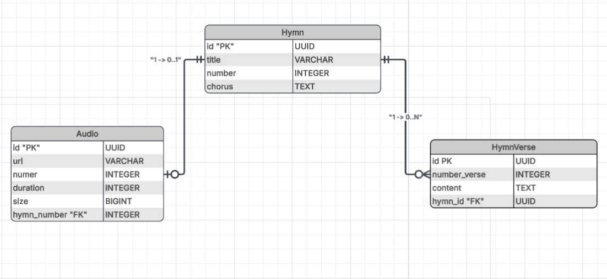

# 🎵 Harpa Cristã API

A **Harpa Cristã API** é uma API REST desenvolvida em **Java** com **Spring Boot**, criada para disponibilizar de forma simples, rápida e organizada os hinos da **Harpa Cristã**, incluindo informações como título, refrão, estrofes e áudio.

O projeto foi desenvolvido com foco em **boas práticas de arquitetura**, **performance**, **segurança** e **escalabilidade**, servindo tanto como um projeto de estudo quanto como um projeto de portfólio para demonstrar conhecimentos em desenvolvimento Backend moderno utilizando Java.

---

# Objetivos da API

- Disponibilizar os hinos da Harpa Cristã através de uma API REST.
- Consultar hinos por número ou título.
- Disponibilizar o refrão e todas as estrofes.
- Disponibilizar o áudio oficial de cada hino.
- Fornecer uma API organizada para aplicações Web e Mobile.
- Demonstrar boas práticas de desenvolvimento com Spring Boot.

---

# Tecnologias Utilizadas

## Backend

- Java 25
- Spring Boot 4.1
- Spring Data JPA
- Spring Bean Validation

## Infraestrutura

- Redis
- Docker

## Banco de Dados

- PostgreSQL
- Flyway

## Cloud

- Cloudflare R2 (armazenamento dos arquivos MP3)

## Doc

- Swagger


---

# Arquitetura

O projeto segue uma arquitetura em camadas:

```
Controller
      │
      ▼
Service
      │
      ▼
Repository
      │
      ▼
PostgreSQL
```

Os arquivos de áudio ficam armazenados no **Cloudflare R2**, enquanto apenas os seus metadados são persistidos no PostgreSQL.

---

# Diagrama de Entidade Relacional

A aplicação possui três entidades principais.

<p>
    
</p>

O relacionamento é realizado através do **número do hino (number)**.

---


# Funcionalidades

- Buscar todos os hinos
- Buscar hino por número
- Buscar hino por título
- Obter refrão
- Obter informações do áudio
- Validação de dados
- Migração automática do banco com Flyway

---

# Endpoints

## Hinos

| Método | Endpoint |
|----------|----------------|
| GET | /api/v1/hymn | lista todos os hinos
| GET | /api/v1/hymns/{number} | busca hino por numero
| GET | /api/v1/hymns/search?title= | busca hino por titulo
| GET | /api/v1/hymn?page=0&size=10 | paginação (opcional)  

---

## Áudios

| Método | Endpoint |
|----------|----------------|
| GET | /api/v1/audios/{number} | busca audio por numero

---


# Banco de Dados

O banco é gerenciado através do **Flyway**, garantindo versionamento das migrações.

Todas as tabelas são criadas automaticamente durante a inicialização da aplicação.

---

# Cloudflare R2

Os arquivos MP3 não são armazenados no banco de dados.

Cada áudio fica salvo em um bucket do Cloudflare R2.

Exemplo:

```
bucket-harp/
    hymns/
        001.mp3
        002.mp3
        003.mp3
```

No PostgreSQL são persistidos apenas:

- URL
- duração
- tamanho
- número do hino

---

# Segurança

A API utiliza:

- Validação com Bean Validation
- Tratamento global de exceções
- Respostas padronizadas
- Arquitetura seguindo princípios de DDD

---

# Como executar

## Clonar o projeto

```bash
git clone https://github.com/seu-usuario/harpa-crista-api.git
```

---

## Configurar o PostgreSQL

Crie um banco:

```sql
CREATE DATABASE DB_HARP;
```

---

## Configurar o application.yml

```yaml
spring:
  datasource:
    url: jdbc:postgresql://localhost:5432/DB_HARP
    username: postgres
    password: senha

  jpa:
    hibernate:
      ddl-auto: validate

  flyway:
    enabled: true
```

## Configurar as variáveis de ambiente

Crie um arquivo .env na raiz do projeto

```.dotenv

DB_NAME=DB_NAME
DB_USERNAME=YOUR_DB_USERNAME
DB_PASSWORD=YOUR_DB_PASSWORD
DB_PORT=PORT_BD

REDIS_HOST=HOST_REDIS
REDIS_PORT=PORT_REDIS

R2_ENDPOINT=YOUR_ENDPOINT
R2_ACCESS_KEY=YOUR_ACCESS_KEY
R2_SECRET_KEY=YOUR_SECRET_KEY
R2_PUBLIC_URL=YOUR_PUBLIC_URL
R2_BUCKET_NAME=YOUR_BUCKET

```

---

## Executar

```bash
docker compose up --build
```

---

# Roadmap

- [x] Cadastro dos hinos
- [x] Cadastro das estrofes
- [x] Cadastro dos áudios
- [x] Integração com Cloudflare R2
- [x] Cache com Redis
- [X] Documentação Swagger/OpenAPI
- [x] Docker
- [x] Docker Compose
- [x] Testes unitários


---

# Licença

Este projeto possui finalidade **educacional** e **demonstrativa**, sendo desenvolvido para compor portfólio profissional e servir como referência de arquitetura Backend, Feito com Java, Spring Boot e fé.

Deus Abençoe a Todos.
